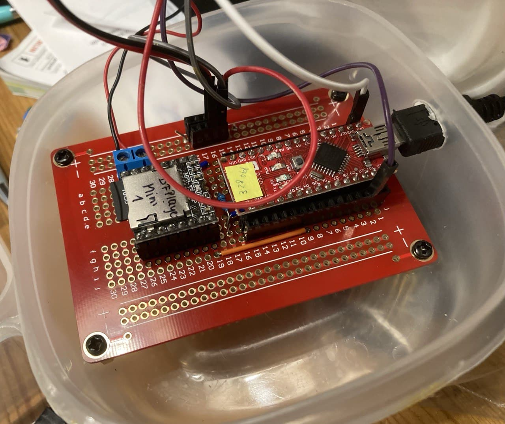

# Speaking Halloween Pumpkin With Arduino
This was a little fun project for Halloween. We used a real pumpkin, of course. But we added a small Arduino setup that enabled the pumpkin to talk and glow whenever somebody approached. Got hilarious reactions!

## Features
* motion-triggered (courtesy of PIR sensor)
* LED illumination with changing rainbow colors
* talks and makes scary noises (a randomly selected sound file is played - let the kids have fun recording their own!)

Here is our pumpkin (it looked more impressive in the dark, of course!). The white dot in the lower part is the PIR sensor.

## Components
Here is what I used...

* Arduino Nano
* 12 NeoPixel Ring
* DFRobot DFPlayer Mini
* PIR sensor - I got some really tiny ones :-)
* 1kΩ Resistor
* speaker
* prototyping board, jumper wires, pin header, screw terminals, ... - whatever you like to use. I soldered my setup unto a pcb board (the black one in the picture) and built a casing out of a plastic box.
* a power source... I simply plugged a power bank into the mini usb port of the Nano.

## Wiring
This is the same setup you can see in the photo above (the one with the red PCB board). My final design was slightly different (I moved the pin headers for the PIR and Neopixel to a more convenient place, was all.)

## TF card
The sounds are stored on a mini SD TF card. The DFPlayer Mini is rather fickle. If you get com errors it might be caused by the TF card (read the documentations!).

For this project the sound files must be placed in folder '01' on the sd card. The files' names must start with a 4-digit number, e.g. '0001.mp3' or '0002_roar.mp3', and the numbering must be continuous, starting with 0001. The sketch reads the number of files present in that folder and plays them in a random order.

You can copy the mp3 folder included in this repository and add custom sound files to it.

## Code
You can find the Arduino code in the folder 'code'. It consists of the sketch proper and two custom libraries. Be sure to download all three!

You also need to install two libraries in your Arduino IDE:
* Adafruit Neopixel (I use the current version 1.10.1)
* DFPlayer Mini Mp3 by Makuna (current version is 1.0.7)
